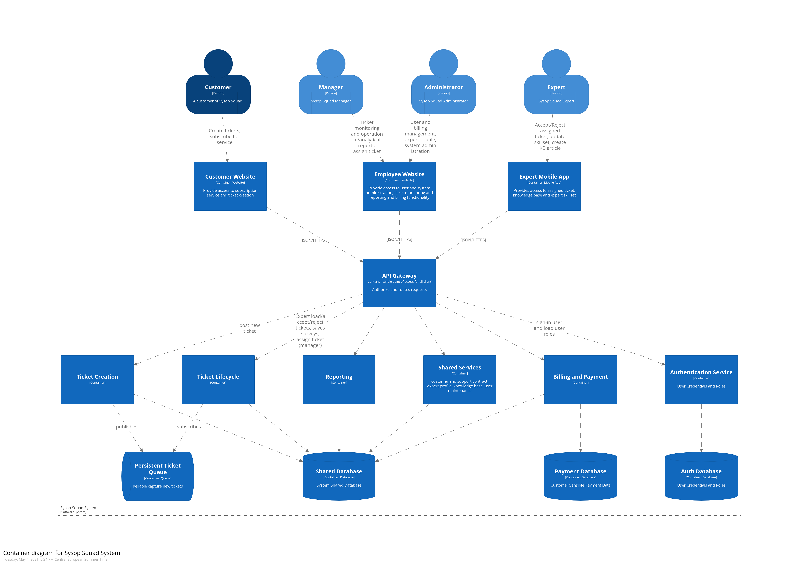

# Solution Overview
## Purpose 

The following chapters provide a architectural overview of the solution.The [C4 Model](https://c4model.com/) is used to give an overview about the new architecture of the ticketing system. 

## Solution goals

The proposed design provides a simple approach to create a new reliable and flexible solution for the SysOps Squads trouble ticket system.
The new system should deliver a better user experience and resolve the issues which are outlined in the [Problem Background](../Problem%20Background/System%20Analysis.md) in a timely manner.

## Principals

In order to be able to drive conversations and architectural decisions, it seemed important to set clear principals and so the presented architecture was designed with the following ones in mind:

- **Simple** and **pragmatic**. The problems of the current system are impactful for the business and it is important to fix them in a timely manner.
- **Priority** to fixing current situation.
- **Flexibility** for future improvement. It also seemed appropriate to decouple some of the responsibilities without replacing them while keeping the system open to future changes.

## Context

The system doesn't have a lot of interfaces. It provides the users the needed information with taylored interfaces and rely on 3rd party services for sending notifications to increase efficency and user experience for all the stakeholders.  
The users can be seen as four different roles which interact with the system: 
1. The customer  - **external**
1. The Expert 
1. The Administrator
1. The Manager

## Conceptional Model
The concept is to segregate the load intensive and important components. Each of the containers represent a separate deployment unit. With this concept resource intensive components like Reporting triggered by internal users does not affect the customer facing part of the application. 
The segregation is also done in the frontend. The webpages are segregated to serve only for internal or external users to isolate the different use cases.  

## Ticket Workflow Alteration

It is difficult to adapt the process without the input of the Business. It would be interesting to run a co-creation workshop where the process could be altered to ensure tickets are not lost or incorrectly assigned. 

Although here is a proposal  that embed a feedback mechanism from expert when a ticket is assigned to them. It is important to mention here as well that having experts maintaining their own skill set in the system instead of the manager would be crucial to improve the reliabliity of the assignation algorithm.

## Container Decomposition 
The following chapter describes the structure of the core containers 

### Payment
The payment container is split into a payment controller and a billing history component. 
The sensitive data are kept in a seperate database. 

### Shared services
This container is designed to provide the functionality for multiple domains. 
The functions are not business critical and aren't load intensive. 
The covered domains: 
- Expert profiles
- User maintenance
- Knowledge base articles
- Contract management
- Customer profiles

### Ticket lifecycle
This container provide the critical functionaltiy of managing tickets. 
The core component of this container is the ticket workflow component and it is implementing the processes and orchestrate the other components.

### Ticket creation 
This container provide the functionality for the ticket creation. 
To assure that no tickets get lost a queueing should be implemented.

